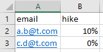

# Unit Test Practice

This is an area to practice unit-testing in times of high dependency.

## The Opportunity

With all the reuse possible today, a little code can achieve a lot.
Of course, this comes with a lot of dependency on the re-used code.
Unit tests focus on isolating our code from dependencies.
However,
the functionality can feel 'empty' after removing dependencies.
The resulting unit-tests may not give confidence about real-life behavior.

The opportunity is to sustain confidence in small pieces of code
with fast feedback from unit tests.

## Our Playground

Let's say our product needs to read [this excel](emails-to-send.xlsx):

...then send email information to employees about their hike.

It's good to do this in executable code, rather than pseudocode.
Let's start with python. 

Is it easy to read this excel file in python?
See [this file](read-excel-poc.py) for an implementation
to read `emails-to-send.xlsx` and print its contents -
it's a couple of lines of code.
